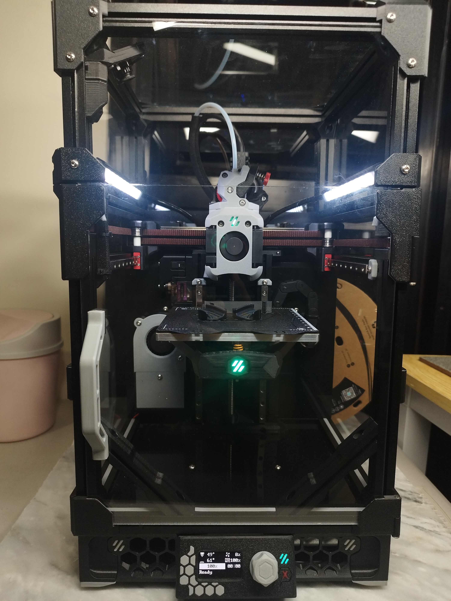

## Compact DIY 3D Printer *"Mirage"*

A compact DIY 3D printer built for versatility, portability, and performance.
Fast print speeds and setup times make it an excellent backup printer for small parts, and ideal for on-the-go demos and presentations.
Powered by Klipper firmware, the printer can be fully operated from any device with a web browser, as long as it's connected on the same network.

This is a personal project based on the Voron 0.2 by VoronDesign, with several custom modifications to enhance usability and performance.

#### **Hardware Changes from Stock Design** :
- Base Kit: Siboor V0.2
- Custom *“Dragonburner”* Toolhead
  - Lightweight toolhead design
  - Dual 4010 part cooling fans
  - RGB LED nozzle lighting & RGB LED logo 
  - Customized *"Wristwatch"* BMG extruder
  - Separate control board
- Servo-deployed magnetic Z-probe
- Dual shear A/B motor mounts
- Recirculating carbon air filter
- Removable and taller top-hat with lever camlocks
- Magnetic backplate w/ cooling fan and USB C port
- Re-routed rear filament path w/ detection switch
- Foldable spool holder
- Purge bucket
- Enclosure temperature monitoring
- Low-profile side handles
- Frame stiffening braces
- Electronics side cover
- Integrated RGB LED lighting and remote monitoring camera

#### **Software Changes**  :
- Custom Klipper configuration with personal tuning
- Extensive custom macros for automation and maintenance
- New UI display interface commands