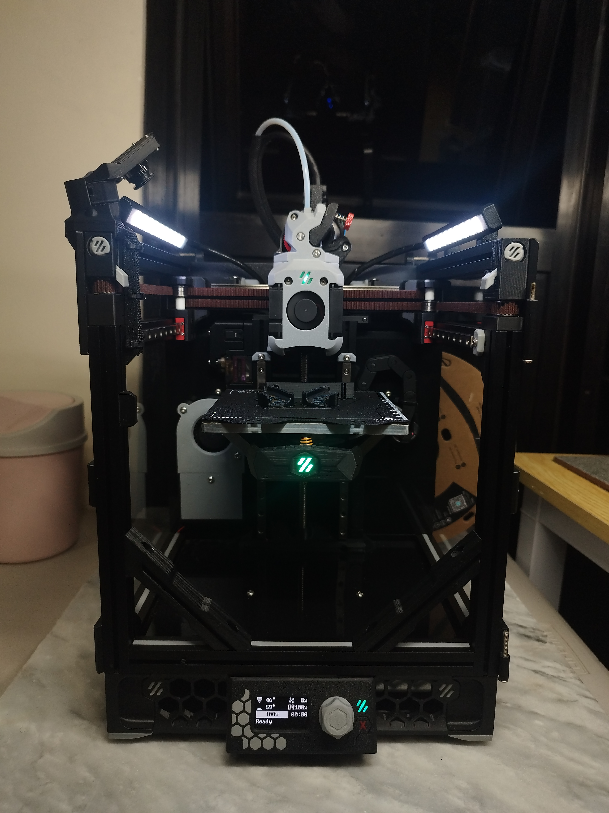

# Technical Projects
2025 
"***Mirage***" - A small and portable DIY 3D printer built for versatility and performance 
"***SIGLA***" - A neurotech project under EDA-IBEHT in collaboration with DOST-PCHRD

2024 
Unpublished toolhead for 3D printer Kingroon KP3S 3.0

2019 
"***Hiraya***" - A four wheeled prototype eco vehicle running on diesel engine

2018 
"***Agimat V2.0***" -  A three wheeled prototype eco vehicle running on a lithium-ion battery

## Portable DIY 3D Printer *"Mirage"* (2025)(On-going)

  
  

- A compact and portable DIY 3D printer built for versatility and performance.
- Fast print and setup times make it an excellent backup printer for small parts, and ideal for on-the-go demos and presentations.
- Powered by Klipper firmware, the printer can be fully controlled from any device with a web browser, as long as it's on the same network.  

- This is a personal project based on the Voron 0.2 by VoronDesign, with several custom modifications to enhance usability and performance.
- The design, assembly and configuration process was handled end-to-end.
- Designed in CAD: **Siemens NX**

#### **Hardware Changes from Stock Design** :
- Custom *“Dragonburner”* Toolhead
  - Lighter toolhead design
  - Dual 4010 part cooling fans
  - RGB LED nozzle lighting & RGB LED logo 
  - Customized Wristwatch BMG extruder
  - Separate CAN-based control board
- Servo-deployed magnetic Z-probe
- Dual shear A/B motor mounts for improved structural rigidity
- Recirculating carbon air filter
- Removable and taller top-hat with lever camlocks
- Foldable spool holder
- Purge bucket
- Chamber thermistor for enclosure temperature monitoring
- Low-profile side handles
- Frame stiffening braces
- Integrated RGB LED lighting and remote monitoring camera

#### **Software Changes** *(Ongoing Development)* :
- Custom Klipper configuration with personal tuning
- Extensive custom macros for automation and maintenance
- New UI display interface commands
## Neurotech Project *"SIGLA"* (2025)

  
  

- A neurotech project under EDA-IBEHT in collaboration with DOST-PCHRD.
- Utilizes EEG and virtual reality technologies to support depression therapy by analyzing EEG signals within an immersive virtual environment.
#### Role: Prototype and VR Development

- Design, development, and assembly of the prototype 3D printed components. 
- Parts fabrication by operating multiple FDM printers.
- Designed in CAD: **Blender**
- Assist main VR developer in creating necessary scripts for the Unity project.
- Developed scripts using: **Python** and **C#**

## Unpublished toolhead for 3D printer Kingroon KP3S 3.0 (2024)

  
  

- A retrofitted toolhead into the commercial 3D printer by Kingroon KP3S 3.0
- Offers improved part cooling, enabling faster print speeds and the ability to print non-exotic, high temperature materials (ABS and ASA).
- The design highlights:
  - Used the original mounting plate, extruder, X homing switch and wire harness
  - Has a BLTouch bed levelling probe
  - Has an all metal hotend
  - Dual 4010 fans for part cooling
  - Robust assembly and hidden wires
  - Everything was bolted with nuts for assembly (I didn't have threaded inserts on hand)
- Current design is not optimized and is for personal use only. It was needed immediately to print **ABS** parts.
- Designed in CAD: **NX Siemens**

## Eco Car *"Hiraya"* (2019)

- A four-wheeled prototype eco vehicle running on diesel engine.
- Represented DLSU-D in the Shell Eco-Marathon Asia 2018 under the "Urban Concept - ICE" category. 
#### Role: Lead Mechanical Design

- Design and layout of the entire vehicle but mainly focused on the frame, chassis, steering mechanism and covers.
- Parts fabrication by operating CNC mills as well as manual milling machines and lathes.
- Designed in CAD: **Solidworks**

## Eco Car *"Agimat V2.0"* (2018)

- A three-wheeled prototype eco vehicle running on a lithium-ion battery
- Represented DLSU-D in the Shell Eco-Marathon Asia 2018 under the "Prototype - Battery 
Electric" category, securing 15th place based on fuel efficiency among numerous participating teams.
#### Role: Mechanical Design

- Redesign and layout of the frontal structure, which includes: steering, front suspension, wheels, brakes, structural weight reduction, overall assembly, and other minor components.
- Parts fabrication by operating CNC mills as well as manual milling machines and lathes.
- Designed in CAD: **Solidworks**

