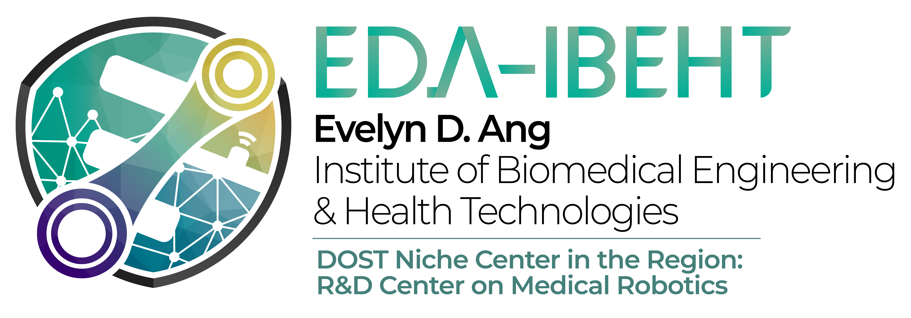

# Technical Projects
2025 
"***Mirage***" - A compact DIY 3D printer built for versatility, portability, and performance 
"***SIGLA***" - A neurotech project under EDA-IBEHT in collaboration with DOST-PCHRD

2024 
Unpublished toolhead for 3D printer Kingroon KP3S 3.0 
Mechanical design work for autonomous forklifts (AGF's)

2019 
"***Hiraya***" - A four-wheeled prototype vehicle running on diesel engine

2018 
"***Agimat V2.0***" -  A three-wheeled prototype vehicle running on a lithium-ion battery

## Compact DIY 3D Printer *"Mirage"* (2025)(On-going)

A compact DIY 3D printer built for versatility, portability, and performance.
Fast print speeds and setup times make it an excellent backup printer for small parts, and ideal for on-the-go demos and presentations.
Powered by Klipper firmware, the printer can be fully operated from any device with a web browser, as long as it's connected on the same network.

["Open Project Folder"](./A3D%20Mirage%20-%20Compact%20DIY%203D%20Printer/)
- The design, assembly and configuration process was handled end-to-end.
- Designed and layout using CAD: **Siemens NX**

## Neurotech Project *"SIGLA"* (2025)

  
  

A neurotech project under EDA-IBEHT in collaboration with DOST-PCHRD. Utilizes EEG and virtual reality technologies to support depression therapy by analyzing EEG signals within an immersive virtual environment.
#### Role: Prototype and VR Development

- Design, development, and assembly of the prototype structure. 
- Parts fabrication by operating multiple FDM 3D printers.
- Assist main VR developer in creating necessary scripts for the Unity project.
- Designed and layout using CAD: **Blender**
- Developed scripts using: **Python** and **C#**

## Unpublished toolhead for 3D printer Kingroon KP3S 3.0 (2024)

A retrofitted toolhead into the commercial 3D printer by Kingroon KP3S 3.0 Offers improved part cooling, enabling faster print speeds, automatic bed leveling and the ability to print non-exotic, high temperature materials (ABS and ASA) compared to stock toolhead.

- Current design is not optimized and is for personal use only. It was needed immediately to print **ABS** parts.
- Designed and layout using CAD: **NX Siemens**
  

#### **Design highlights** :
  - Used the original mounting plate, extruder, X homing switch and wire harness
  - BLTouch bed levelling probe
  - TZ-V6 2.0 all metal hotend
  - Dual 4010 fans for part cooling
  - Robust assembly and hidden wires
  - Everything was bolted with nuts for assembly (I didn't have threaded inserts on hand)

## Autonomous Forklifts (AGF's) (2023-2024)

A computer-controlled, driverless forklift designed to autonomously transport, load, and unload pallets in warehouses and distribution centers. 

["Goto Product Web Page"](https://sumitomonacco.co.jp/en/products/forklift/AGF.html)

#### Role: Sub Team Lead / Design Engineer

- Managed and coordinated the Filipino engineering team in the design work of a prototype autonomous forklift,
ensuring alignment and efficient collaboration with the Japanese parent team. 
- Designed new forklift components focused on sensor integration for vehicle autonomy and telemetry using **Creo PTC** and **NX Siemens**, handling the full design lifecycle including conceptualization, layout, modeling, drafting,
documentation, and design data management.
- Carried out design work for brackets, covers, sheet metal, welded, and machined components, wire harnesses, and
modification of existing parts to integrate sensors according to task specifications.
- Practiced reverse engineering, advanced parametric & rapid prototype modelling, GD&T analysis, simple static NX
FEA, reading electrical schematic & wiring diagrams, creating assembly guides, BOM creation, and processing ECNs.

## Eco Car *"Hiraya"* (2019)

A four-wheeled prototype eco vehicle running on diesel engine. Represented DLSU-D in the Shell Eco-Marathon Asia 2019 under the "Urban Concept - ICE" category. 
#### Role: Lead Mechanical Design

- Design and layout of the entire vehicle but mainly focused on the frame, chassis, steering mechanism and covers.
- Aluminum parts fabrication by operating CNC mills as well as manual milling machines and lathes. Exterior covers are made of composite fiber glass material, sheet metal, and clear polycarbonate sheets.
- Designed and layout using CAD: **Solidworks**

## Eco Car *"Agimat V2.0"* (2018)

A three-wheeled prototype eco vehicle running on a lithium-ion battery Represented DLSU-D in the Shell Eco-Marathon Asia 2018 under the "Prototype - Battery 
Electric" category, securing 15th place based on fuel efficiency among numerous participating teams.
#### Role: Mechanical Design

- Redesign and layout of the frontal structure, which includes: steering, front suspension, wheels, brakes, structural weight reduction, overall assembly, and other minor components.
- Aluminum parts fabrication by operating CNC mills as well as manual milling machines and lathes.
- Designed and layout using CAD: **Solidworks**

